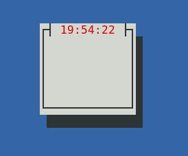
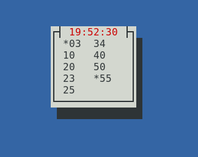

# Ary-Clock

Requirements
------------

I haven't tested building this application directly on Windows, but executing the binary published on ary-clock-releases/1.0.0/x86_64-windows-gnu from a terminal (cmd.exe or powershell) will be enough since the binary is statically built.

On Linux, this application uses the ALSA sound system through the `alsa-sys` crate. In order for it to correctly compile, according to instructions in their build.rs file, you need to run:

`dnf install alsa-lib-devel` on Fedora

`apt-get install libasound2-dev` on Debian/Ubuntu

The released binary file on ary-clock-releases/1.0.0/x86_64-linux-gnu was linked dynamically against ALSA so it will crash when it tries to play an alarm if you don't have it installed (sorry), in order to be able to run that binary, installing `libasound2` on Debian/Ubuntu or `alsa-lib` on Fedora should suffice.

If the binary file for ARM-Linux crashes when playing an alarm, same thing, install `libasound2` on Debian/Ubuntu or `alsa-lib` on Fedora.

Compiling and Running
---------------------

To compile and run the application you need to have Rust and Cargo installed. Once both are installed in your system, clone this project, navigate to the root folder, and execute `cargo run` in the terminal. That will compile the application the first time, and subsequently run it. To separate both steps, use `cargo build` first, and then `cargo run`.

If it succeeds, you will be presented with an ncurses-style small blue rectangle with the time on the header.

Usage
-----

* To quit the program press `q`
* To add an alarm type two digits representing a minute, all integer values between `00` and `59` inclusive are valid. The number will be added to a list inside the rectangle, representing the alarm has been added.
* You can store up to 10 different alarms in the list.
* The clock works by playing `soundalarm.wav` every hour at the minutes marked by the alarm.
* To remove an alarm, type its number again.
* To create an alarm that plays the alternate file `soundalarm2.wav`, type `*` followed by your two-digit number.
* Those alarms can also be removed simply by typing their number again (no need to write down `*`)

Removing and adding alarms might be a bit fiddly at first, since there's no visual feedback for when you have written one digit and the system is still waiting for the second one, but you get used to it.

Platforms
---------

This software can be cross-compiled for Windows and Linux on ARM (and macOS but I haven't personally tested that). For convenience I published the binaries in the releases folder, they were created using the Rust Cross project and plenty of elbow grease.

License
-------

This software is released under the MIT License, the binaries link statically to the GNU C libraries and as such they are licensed under the GPL.
